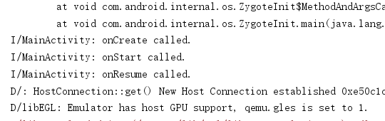
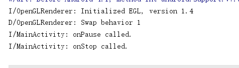
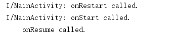
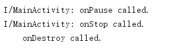

# HelloWorld
安卓移动开发实验一 验证Activity的生命周期

关键代码：

public class MainActivity extends AppCompatActivity {

    private static final String TAG = "MainActivity";
    
    @Override
    protected void onCreate(Bundle savedInstanceState) {
        super.onCreate(savedInstanceState);
        setContentView(R.layout.activity_main);
        Log.i(TAG,"onCreate called.");
    }

    protected void onStart(){
        super.onStart();
        Log.i(TAG,"onStart called.");
    }

    protected void onResume(){
        super.onResume();
        Log.i(TAG,"onResume called.");
    }

    protected void onPause(){
        super.onPause();
        Log.i(TAG,"onPause called.");
    }

    protected void onStop(){
        super.onStop();
        Log.i(TAG,"onStop called.");
    }

    protected void onDestroy(){
        super.onDestroy();
        Log.i(TAG,"onDestroy called.");
    }

    protected void onRestart(){
        super.onRestart();
        Log.i(TAG,"onRestart called.");
    }
}

app运行时控制台截图：

app后台时控制台截图：

app切换到前台控制台截图：

app退出后控制台截图:

